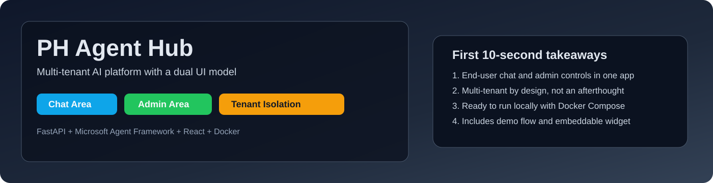
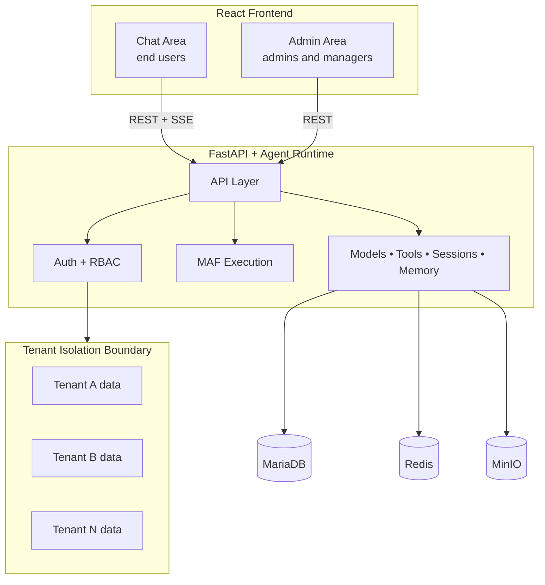

# PH Agent Hub



[](LICENSE)
[](https://github.com/kainotomo/ph-agent-hub)
[](https://github.com/kainotomo/ph-agent-hub)
[](https://github.com/kainotomo/ph-agent-hub/issues)
[](https://github.com/kainotomo/ph-agent-hub)
[](https://github.com/kainotomo/ph-agent-hub/actions)

PH Agent Hub is a multi-tenant AI application platform for teams that need both:
- a production chat experience for end users
- an operational admin control plane for models, tools, tenancy, and governance

It is built on FastAPI + React and uses the [Microsoft Agent Framework](https://github.com/microsoft/agent-framework) for agent runtime orchestration.

Live demo: [agent.kainotomo.com/demo](https://agent.kainotomo.com/demo)

## Why This Exists

Most open-source AI chat projects are strong at single-tenant chat UX or developer experimentation. PH Agent Hub is optimized for teams shipping tenant-isolated AI products where operations matter as much as chat quality.

What you get in one system:
- dual UI model: Chat Area + Admin Area in one web app
- tenant isolation at the backend authorization and data layer
- model and tool governance per tenant
- embedded website widget for anonymous or guided external usage
- deployment that stays simple: Docker Compose dev and prod paths

## Run In 3 Commands

```bash
git clone https://github.com/kainotomo/ph-agent-hub.git
cd ph-agent-hub/infrastructure
cp env.example env
```

Then set required env values in env and start:

```bash
docker compose up --build
```

Required env values:

| Variable | Why it is required |
|---|---|
| JWT_SECRET | Signs access and refresh tokens |
| ENCRYPTION_KEY | Encrypts provider API keys at rest |
| ADMIN_EMAIL | Bootstraps initial admin user |
| ADMIN_PASSWORD | Bootstraps initial admin password |
| At least one provider key | Enables model inference (DeepSeek/OpenAI/Anthropic/etc.) |

Endpoints after startup:
- App: [http://localhost](http://localhost)
- phpMyAdmin (dev): [http://localhost:8080](http://localhost:8080)
- MinIO Console (dev): [http://localhost:9001](http://localhost:9001)

Default login on first run: admin@phagent.local / admin (change immediately).

## Who It Is For

- Teams building tenant-aware AI SaaS or internal multi-business-unit copilots
- Developers who need configurable tools, models, and skills without hard-coding per customer
- Operators who need auditability, usage visibility, and role-based controls

## Differentiators

- Multi-tenant from the core domain model, not bolted on later
- Built-in admin control plane for real operations, not only prompt experimentation
- DeepSeek stabilizer layer (reasoning strip, JSON repair, retry orchestration)
- Embeddable chat widget with anonymous guest flow and demo-mode support
- Microsoft Agent Framework runtime integration for workflow-friendly agent execution

## How It Compares

Technical comparison for first-pass evaluation.

| Capability | PH Agent Hub | Dify | Onyx | Open WebUI | LibreChat |
|---|---|---|---|---|---|
| First-class multi-tenant isolation | Yes | Partial (varies by setup) | Team-oriented, not full tenant governance | Primarily single-instance | Primarily single-instance |
| Unified Chat + Admin product surfaces | Yes | Yes | More knowledge assistant focus | Chat-first | Chat-first |
| Tenant-scoped model + tool governance | Yes | Partial | Partial | Limited by deployment pattern | Limited by deployment pattern |
| Embeddable widget for external websites | Yes | Yes | Not primary focus | Limited | Limited |
| DeepSeek hardening layer (JSON repair/retry) | Yes | No native equivalent | No native equivalent | No native equivalent | No native equivalent |
| Self-host with one Compose stack | Yes | Yes | Yes | Yes | Yes |
| Built on Microsoft Agent Framework runtime | Yes | No | No | No | No |

Notes:
- "Partial" means achievable but usually depends on custom deployment conventions or enterprise configuration.
- Validate against your own requirements and current upstream versions before final adoption decisions.

## Visual Architecture



For deeper architecture detail, see [docs/architecture-overview.md](docs/architecture-overview.md).

## Feature Snapshot

### End Users
- Streaming chat responses with SSE
- Model selection from tenant-enabled providers
- Templates, prompts, and skills
- File uploads + RAG search support
- Session branching, feedback, full-text search
- Temporary sessions and finalization flow

### Admins And Managers
- Tenant, user, and role management
- Model and tool registration with encrypted secrets
- Template and skill governance
- Usage analytics and audit logs
- Demo tenant and public try-it-now controls

### Platform
- Multi-tenant authorization and data boundaries
- Docker-native deployment for dev and production
- Extensible tools and model adapters
- Backend services that can be patched and extended safely

## Folder Structure

```text
.
├── backend/          # FastAPI app, agent runtime integration, services, DB models
├── frontend/         # React app for Chat Area and Admin Area
├── docs/             # Architecture, guides, deployment and data model docs
└── infrastructure/   # Docker Compose, environment templates, reverse proxy config
```

## Documentation Map

Start here:
- [docs/README.md](docs/README.md)

Role-specific guides:
- [docs/user-guide.md](docs/user-guide.md)
- [docs/admin-guide.md](docs/admin-guide.md)

Engineering references:
- [docs/architecture-overview.md](docs/architecture-overview.md)
- [docs/backend-architecture.md](docs/backend-architecture.md)
- [docs/frontend-architecture.md](docs/frontend-architecture.md)
- [docs/data-model.md](docs/data-model.md)
- [docs/deployment.md](docs/deployment.md)
- [docs/agent-framework-integration.md](docs/agent-framework-integration.md)
- [docs/deepseek-stabilizer.md](docs/deepseek-stabilizer.md)

## GitHub Topics To Set

Recommended repository topics:
- ai-agents
- multi-tenant
- fastapi
- react
- llm
- rag
- self-hosted
- docker-compose
- microsoft-agent-framework
- chat-widget

## License

See [LICENSE](LICENSE).
