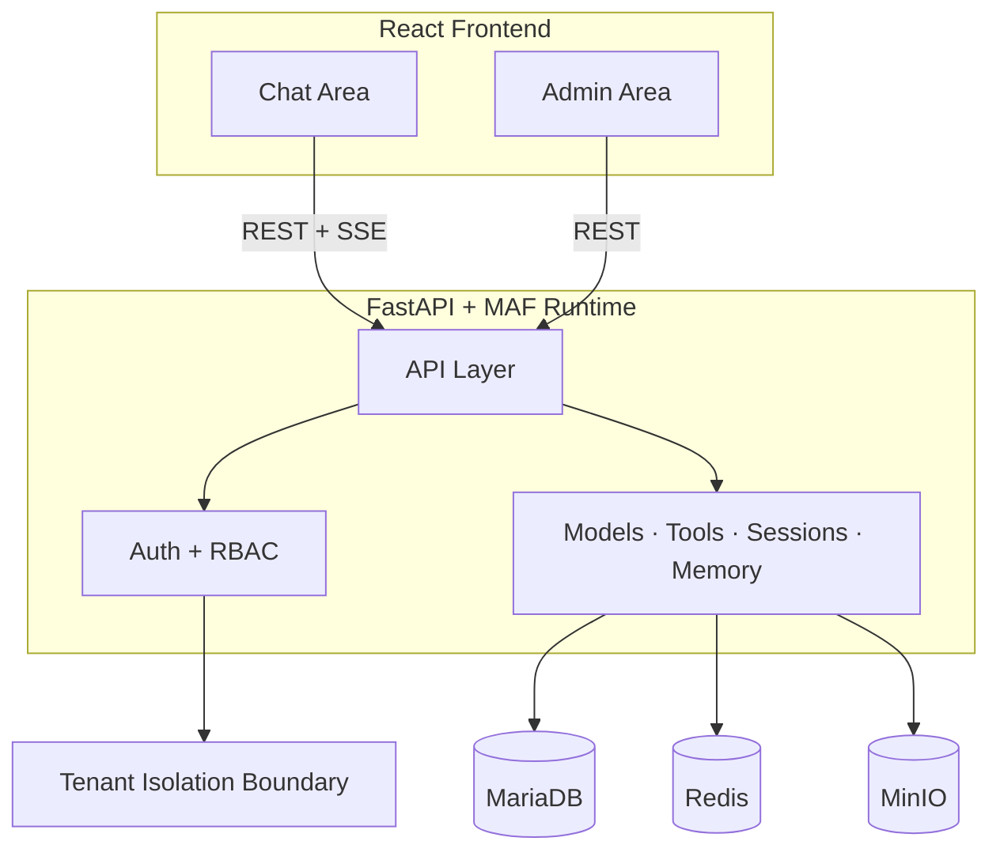

# PH Agent Hub — Architecture Overview

PH Agent Hub is a modular, multi-tenant AI platform designed to provide a stable, extensible environment for agent-driven applications. The system is structured as a monorepo containing two core applications:

- **Backend (Agent Framework Server)**
- **Frontend (React Web App)**

The frontend is a single React application with two protected product areas:

- **Chat Area** for end users
- **Admin Area** for administrators

The platform is fully containerized using Docker and includes supporting services such as MariaDB, Redis, and MinIO.


## At A Glance

- One frontend with two protected product surfaces: Chat Area and Admin Area
- FastAPI backend with Microsoft Agent Framework runtime for orchestration
- Tenant isolation enforced through auth claims, RBAC, and backend data scoping
- Compose-based deployment for both development and production footprints

---

## 1. High-Level Architecture

PH Agent Hub is built around a clean separation of responsibilities:



### **1.1 Backend (Agent Framework Server)**
The backend is the core of the platform. It provides:

- Agent execution using the [Microsoft Agent Framework (MAF)](agent-framework-integration.md) — Python, `pip install agent-framework`
- Multi-model orchestration (DeepSeek, OpenAI, Anthropic, Ollama, etc.)
- Tool calling and workflow coordination
- MCP (Model Context Protocol) integration — connect external tool servers
- **A2A (Agent-to-Agent) Protocol** — both Client (use remote agents as tools) and Server (expose agents to the A2A ecosystem)
- MCP (Model Context Protocol) client support — connect any MCP-compliant server for dynamically discovered tools
- DeepSeek-compatible stabilization layer (JSON repair, retry logic, output filtering)
- Multi-tenant routing with tenant-gated licensing (free tier up to 3 tenants; Pro license removes limit)
- User authentication and authorization (JWT)
- Session and message storage (permanent in MariaDB, temporary in Redis)
- Cross-session memory — semantic retrieval of past conversations via embedding-based search
- Memory and RAG
- Temporary session finalization — convert disposable Redis sessions to permanent MariaDB sessions
- ERPNext and external system integrations (via tools)
- REST and streaming APIs consumed by the frontend

The backend is fully patchable and extensible, allowing custom model adapters, tool runners, and agent behaviors.

### **1.2 Frontend (React Web App)**
The frontend is a single deployable React application that shares:

- authentication and token refresh logic
- API client and request handling
- tenant context and capability loading
- design system and shared components
- route guards and role-based navigation

The frontend does **not** run agents directly. It acts as a thin client over the backend and the MAF runtime.

### **1.3 Embeddable Chat Widget**
The embeddable widget lets tenants offer AI chat on external websites. It uses an
**iframe-based architecture**: a vanilla JS loader script (`embed.js`) injects a
chat bubble or inline iframe on the host page, which loads a stripped-down React
chat page (`WidgetPage`) from the PH Agent Hub domain.  The iframe communicates
with the parent via `postMessage` for resize and close events.

Widget visitors are **anonymous guests** — they authenticate via a tenant-scoped
guest token (embedded in the `<script>` tag) rather than a user account. Sessions
are stored in Redis only (temporary, 24h TTL).  See [`embed-widget.md`](embed-widget.md)
for detailed documentation.

### **1.4 Demo Experience (Public)**
The platform includes a public **"Try It Now"** demo experience at the `/demo` route.
No authentication is required — visitors are auto-provisioned an anonymous session
under a configured demo tenant with a 1-hour expiry.

Two access paths exist:
- **Platform demo**: The login page shows a **Try It Now** button when demo mode is enabled,
  linking to `/demo`
- **Embedded demo**: The embed script supports `data-ph-demo="true"` to load the demo
  session instead of a configured widget

See [`admin-guide.md`](admin-guide.md#3-demo-tenant) for configuration instructions.

---

## 2. Chat Area

The chat area is the end-user experience inside the frontend web app. It provides:

- chat sessions and history (permanent or temporary mode)
- conversion of temporary sessions to permanent sessions
- session pinning and title editing
- model selection (with model name shown in each response)
- template, prompt, and skill selection
- personal skill creation and management
- file uploads
- memory management (view, delete, manually add entries, cross-session retrieval)
- session-level tool activation from tenant-approved tools
- auto-sync of session tools when skill changes
- message editing, deletion, and regeneration via non-destructive branching
- message feedback (thumbs up / down) with confirmation before deletion
- full-text search across sessions and messages
- authentication via backend-issued JWT
- real-time streaming responses and agent events
- auto-scroll to bottom when revisiting a session
- follow-up question suggestions after each response
- embedded chat widget — temporary sessions for anonymous website visitors (see [embed-widget.md](embed-widget.md))

The chat area contains no administrative logic.

---

## 3. Admin Area

The admin area is the operational control surface inside the same frontend web app. It is role-aware and serves two roles:

**Administrators (admin)** have full platform-wide access:
- user and tenant management
- model configuration
- tool configuration
- template and skill management
- usage analytics and logs
- system configuration

**Managers (manager)** have tenant-scoped access:
- manage users within their tenant
- create, edit, and delete tools within their tenant
- enable/disable models for their tenant
- manage templates and skills within their tenant
- view tenant-level analytics

This area is role-protected and communicates exclusively with the backend API. The backend enforces all scope boundaries.

---

## 4. Monorepo Structure

The repository is organized as:

```
/backend
/frontend
/infrastructure
/docs
```

Each application has its own Dockerfile and is orchestrated via `docker compose`. Two compose files are provided:

- **`infrastructure/docker-compose.yml`** — development (nginx, exposed ports, phpMyAdmin)
- **`infrastructure/docker-compose.prod.yml`** — production (Traefik, no exposed ports, external volumes)

---

## 5. Deployment Architecture

PH Agent Hub is deployed as a set of Docker services:

- **backend** — Agent Framework server
- **frontend** — single React web app containing chat and admin areas
- **mariadb** — primary relational database
- **redis** — caching, queues, memory store
- **minio** — object storage for file uploads (S3-compatible)
- **optional vector DB** — for RAG
- **nginx** — reverse proxy (dev only)
- **phpMyAdmin** — database admin UI (dev: port 8080; prod: via Traefik subdomain)

This structure supports single-server deployments via Docker Compose, and can be extended to multi-server with a load balancer.

---

## 6. Multi-Tenant Design

The backend supports multiple tenants, each with:

- isolated users (with roles: admin, manager, user)
- isolated models
- isolated tools
- isolated ERPNext instances (optional)
- isolated templates, prompts, and skills
- isolated sessions and memory

Tenants are enforced at the backend level using JWT claims and backend authorization rules. Managers operate within a single tenant boundary and cannot access or affect other tenants.

---

## 7. Extensibility and Monkey-Patching

PH Agent Hub is designed to allow:

- custom model adapters
- DeepSeek stabilization patches
- custom tool runners
- custom agent behaviors
- custom routing logic

This ensures compatibility with evolving LLM behaviors and enterprise integrations.

---

## 8. Goals of the Platform

PH Agent Hub aims to provide:

- a stable alternative to monolithic chat systems
- a clean architecture for agent-driven workflows
- a flexible backend for multi-model orchestration
- a scalable foundation for enterprise AI applications
- a modular system that can be extended without breaking core functionality

---

## 9. Next Steps

Additional documentation is provided in:

- [README.md](README.md)
- [backend-architecture.md](backend-architecture.md)
- [frontend-architecture.md](frontend-architecture.md)
- [data-model.md](data-model.md)
- [deployment.md](deployment.md)
- [deepseek-stabilizer.md](deepseek-stabilizer.md)
- [agent-framework-integration.md](agent-framework-integration.md)

These documents define the detailed implementation plan for PH Agent Hub.
