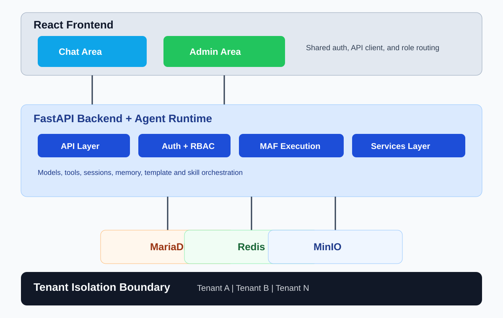

# End User Guide — PH Agent Hub

This guide is for end users (`user` role) who use PH Agent Hub to chat with AI agents. It covers everything you can do in the chat area — from starting your first conversation to using advanced features like branching, memory, and file uploads.

Quick links:
- Documentation index: [README.md](README.md)
- Public demo: [agent.kainotomo.com/demo](https://agent.kainotomo.com/demo)



---

## 1. Getting Started

### 1.0 Trying the Demo (No Account Required)

If the platform administrator has enabled the demo, you can try PH Agent Hub
without creating an account:

1. On the **login page**, click **Try It Now**
2. You're taken to a simplified chat interface — start typing immediately
3. Your session is **anonymous and temporary** — it expires after 1 hour
4. A banner reminds you that conversations are temporary
5. Click **Sign Up Free** on the banner to create a full account

**Limitations of demo mode:**
- Sessions expire after 1 hour — all messages are lost on expiry
- No sidebar, model selector, or settings are available
- No memory or branching
- Rate limits apply (10 sessions/hour, 30 messages/minute)

The demo is intended to give you a quick taste of the platform. For full access,
sign up for an account.

### 1.1 Logging In

1. Open the PH Agent Hub web app in your browser
2. Enter your email and password
3. Click **Log In**

Your login persists across page reloads — you won't need to re-enter your credentials until your session expires.

### 1.2 The Chat Area

After logging in, you'll see the chat area with:
- **Left sidebar**: Your session list, search bar, and new session button
- **Main area**: The active conversation
- **Top bar**: Model selector, template selector, and session controls
- **Input area**: Message composer with skill selector, tool manager, file upload, and memory buttons

---

## 2. Chat Sessions

### 2.1 Create a Session

Click **New Session** in the left sidebar, or start typing a message — a session is created automatically.

Sessions can be:
- **Permanent**: Saved to the database. Appears in your session list. Supports all features.
- **Temporary**: Lives only in Redis. Disappears after inactivity. Does not support branching or editing.

Temporary sessions can be **converted to permanent** — click the **Finalize** button to migrate the session and all its messages from Redis to the database.

### 2.2 Pin a Session

Click the pin icon on any session to keep it at the top of your session list.

### 2.3 Rename a Session

Click the session title to edit it directly. Good titles help you find conversations later.

### 2.4 Convert a Temporary Session to Permanent

If you started a temporary session and later decide you want to keep it, click the **Finalize** button. This converts the session to permanent — all messages are migrated from Redis to the database, and the session appears permanently in your session list.

### 2.5 Search Sessions

Click the delete icon on a session. A confirmation dialog will appear to prevent accidental deletion. Once confirmed, the session and all its messages are permanently removed.

### 2.5 Collapse the Session List

On desktop, click the minimize button on the session sidebar to collapse it and give the chat area more space.

### 2.4 Search Sessions

Use the search bar at the top of the session sidebar. Search matches both session titles and message content.

---

## 3. Chatting with AI

### 3.1 Send a Message

Type your message in the input box at the bottom and press **Enter** (or click Send). The AI responds in real time — you'll see tokens appear as they're generated.

### 3.2 Streaming Responses

Responses stream live via Server-Sent Events (SSE). You'll see:
- **Tokens** appearing word by word as the AI generates them
- **Tool calls** — when the agent uses an activated tool, you'll see what it's doing
- **Step completion** — when a tool call finishes
- **Model name** — each assistant response shows which model generated it (e.g., "DeepSeek R1")

### 3.3 Stop Generation

Click the **Stop** button while the AI is responding to cancel generation. The partial response is saved.

---

## 4. Model Selection

Use the model selector in the top bar to choose which AI model to use. You can only select from models that:
- Your administrator has enabled for your tenant
- Are currently active

Models from various providers may be available, including cloud providers (OpenAI, Anthropic, DeepSeek) and **local models** running via Ollama. Local models appear in the selector with an `(ollama)` label.

Different models have different strengths — try a few to find what works best for your use case.

---

## 5. Templates, Prompts & Skills

### 5.1 Templates

Templates are curated by administrators. They define the AI's behavior — its system prompt, default model, and available tools. Select a template from the dropdown to apply its configuration to your session.

### 5.2 Prompts

Prompts are reusable message templates you create yourself. Save commonly used instructions or question formats as prompts, then insert them into any session.

**Create a prompt:**
1. Click the prompts menu
2. Click **New Prompt**
3. Give it a title and content
4. Save

Your prompts are private — only you can see and use them.

### 5.3 Skills

Skills are reusable execution profiles that bundle model, template, and tool defaults. Selecting a skill changes how the agent behaves — it might switch to a specialized persona or a multi-step workflow.

There are two types of skills:
- **Prompt Based** — A conversational agent with a specific system prompt (from a template), tools, and model. Best for domain-specific assistants like "Tax Advisor" or "Code Reviewer".
- **Workflow Based** — A multi-step orchestration that can coordinate multiple agents, branch on conditions, and wait for human approval. Best for business processes like invoice processing or multi-agent research.

**Create a personal skill:**
1. Click the skills menu (gear icon next to the skill selector)
2. Click **New Skill**
3. Choose the execution type:
   - **Prompt Based**: Select a Template (provides the system prompt), optionally pick a default model
   - **Workflow Based**: Enter the MAF Target Key that matches a registered workflow
4. Optionally add a description
5. Save

Tenant skills (created by admins) are available to everyone in your tenant. You can view and select them but cannot edit or delete them.

The skills list supports search and pagination — if you have many skills, use the search box to find specific ones quickly.

---

## 6. Tools

Tools let the AI interact with external systems — query databases, call APIs, generate documents, or perform actions. Your administrator controls which tools are available.

### 6.1 Available Tool Categories

| Category | Tools | What the AI can do |
|---|---|---|
| **Web** | Web Search, Fetch URL, Browser, RSS Feed, Wikipedia, RAG Search | Search the internet, read web pages, take screenshots, extract tables, search your uploaded documents |
| **Financial** | Stock Data, Market Overview, ETF Data, Currency Exchange, Portfolio, SEC Filings | Get stock quotes, analyze portfolios, check exchange rates, read SEC filings |
| **Enterprise** | ERPNext, SQL Query | Query your ERP system, run read-only SQL on your database |
| **Utility** | Calculator, Code Interpreter, Datetime, Document Generation, Weather | Do math, run Python code, check dates/times, generate PDFs/Excel/CSV, check weather |
| **Communication** | Slack, Email | Send messages to Slack channels; **read, send, search, and manage emails** from your connected accounts |
| **Creative** | Image Generation | Generate images from text descriptions (DALL·E 3, Stable Diffusion) |
| **MCP** | (dynamically synced) | External tools connected by your administrator via MCP servers — GitHub, databases, file systems, or any MCP-compatible service |
| **A2A** | (dynamically synced) | Skills from remote AI agents connected via the A2A (Agent-to-Agent) Protocol — your agent can collaborate with other agents across different platforms |
| **Productivity** | Calendar, Tasks | Check your calendar, schedule meetings, find free time slots; **create, update, and manage tasks and to-do lists** from your connected accounts |
| **DevOps** | GitHub | Search code, list issues/PRs, read files from GitHub/GitLab repos |

### 6.2 Activate Tools

1. Click the **Tools** button in the input area
2. Toggle on the tools you want the AI to use in this session
3. The AI will now be able to call these tools when relevant

You can only activate tools that your administrator has approved for your tenant.

### 6.3 Always-On Tools

You can mark a tool as **always-on** — it will be automatically activated for every new session you create. In the tool selector, toggle the always-on switch next to a tool. Your preference is saved and applied to all future sessions.

### 6.4 Tool Activation on Skill Change

When you change the selected skill during a session, the active tools are automatically updated:
- Tools associated with the old skill are removed
- Tools associated with the new skill are added
- Tools you've marked as always-on are preserved

### 6.5 Working with A2A Remote Agents

A2A (Agent-to-Agent Protocol) **Remote Agent** tools let your AI assistant collaborate with other AI agents hosted on different platforms, rather than calling individual APIs or tools.

**How it works:**
- Your administrator connects to remote A2A-compatible agents via the admin panel
- Each remote agent's capabilities (skills) are automatically discovered and synced as tools
- You activate them like any other tool — toggle them on in the tool selector

**What to expect:**
- **Latency**: Remote agents take longer to respond than local tools — the AI needs to communicate with another agent across the network
- **Availability**: A remote agent may be temporarily unavailable if its server is down or the circuit breaker has tripped (the system will automatically retry and recover)
- **Visibility**: The AI will tell you when it's using a remote agent — the response will indicate which external agent was contacted
- **Failures**: If a remote agent fails, the AI will receive an error message and can try again or report the issue to you

This ensures the agent always has the right tools for the selected skill without manual reconfiguration.

### 6.4 Deactivate Tools

Toggle a tool off to prevent the AI from using it. The change takes effect immediately.

### 6.5 Tips for Using Tools

- **Be specific** — "Show me the stock price of AAPL for the last 30 days" works better than "What's happening with Apple?"
- **Activate only what you need** — too many active tools can slow down responses
- **Check tool results** — the AI shows you what each tool returned so you can verify accuracy
- **Financial tools are free** — stock data, market overview, and currency exchange require no API keys
- **Generated files** — PDFs, Excel files, images, and screenshots appear as download links in the chat
- **Personal accounts** — tools like Email, Calendar, and Tasks can use your own connected accounts. Set them up in **Account Settings** (gear icon in the sidebar)

---

## 8. Account Settings

Account Settings lets you connect your personal email, calendar, and task accounts so the AI agent can read, send, and manage them on your behalf.

### 8.1 Accessing Account Settings

Click the **gear icon** ⚙️ in the chat sidebar (next to Logout) to open Account Settings, or navigate directly to `/settings`.

### 8.2 Connecting an Email Account

The agent can connect to any email account that supports IMAP (Gmail, Outlook, Yahoo, Fastmail, etc.).

**Option A: Google OAuth (recommended)**
1. In Account Settings, click **Connect Account** under Email
2. Click **Google (Gmail)**
3. A Google consent popup opens — sign in and grant access
4. You're redirected back to Account Settings — the account appears with a green dot

**Option B: Microsoft OAuth (recommended)**
1. Click **Connect Account** → **Microsoft (Outlook)**
2. Sign in via the Microsoft consent popup

**Option C: Manual IMAP setup**
1. Click **Connect Account** → **Other Email (IMAP)**
2. Fill in:
   - **Account Label** — a name you'll recognize (e.g., "Work Email")
   - **Email Address**
   - **IMAP Server** and **Port** (typically `imap.gmail.com:993` for Gmail)
   - **SMTP Server** and **Port** (typically `smtp.gmail.com:587` for Gmail)
   - **Password** — use an **app password** if you have 2FA enabled (see your provider's security settings)
3. Click **Test Connection** to verify the credentials work
4. Click **Save Account**

### 8.3 Connecting Calendar and Tasks

If you've connected a Google or Microsoft account via OAuth, you can connect calendar and tasks using the same provider. Click **Connect Account** under Calendar or Tasks and choose the provider — the OAuth popup will request the necessary permissions automatically.

For Google, the same OAuth consent can grant access to Gmail, Google Calendar, and Google Tasks simultaneously.

### 8.4 Managing Connected Accounts

Each connected account shows:
- **Status dot** — 🟢 Active, 🟡 Expired (reconnect needed), 🔴 Error
- **Provider badge** — Gmail, Outlook, or IMAP
- **Default star** ⭐ — clicking sets this account as the default
- **Test button** 🔄 — tests the connection
- **Remove button** 🗑️ — removes the account (agent can no longer access it)

You can have **multiple accounts** for the same tool type (e.g., Work Gmail + Personal Gmail). When you have multiple accounts, use the `account_label` parameter to tell the agent which one to use.

### 8.5 What the Agent Can Do

Once connected, the agent can:
- **Read emails** — "What's in my inbox?"
- **Search emails** — "Find emails from Sarah about the budget"
- **Get full email body** — "Show me the full content of the first email"
- **Send emails** — "Send a reply saying I'll review it tomorrow"
- **Mark as read/unread** — "Mark that email as read"
- **Move to folders** — "Move it to my Work folder"
- **List folders** — "What folders do I have?"
- **Check calendar** — "What meetings do I have today?"
- **Create events** — "Schedule a 30-minute call with Bob tomorrow at 2 PM"
- **Manage tasks** — "Create a task to review the Q3 budget by Friday"

### 8.6 Troubleshooting

- **"Test connection failed"** — verify your IMAP/SMTP server addresses and port numbers. For Gmail/Outlook with 2FA, use an **app password** (not your regular password).
- **"Token expired"** (OAuth only) — click the **Reconnect** button next to the account to re-authenticate.
- **"No accounts connected"** — the agent will tell you if no email/calendar/task accounts are found. Go to Account Settings to add one.

---

## 9. File Uploads

You can attach files to your chat sessions for the AI to reference.

### 7.1 Upload a File

1. Click the **Upload** (paperclip) button in the input area
2. Select a file from your computer
3. The file is uploaded and attached to the current session

**Supported file types**: Plain text, CSV, Markdown, PDF, JSON, PNG, JPEG, GIF, WebP.
**Maximum file size**: 100 MB.

### 7.2 File Limitations

- Uploaded files are stored securely and scoped to your session

### 7.3 Delete an Upload

Hover over an uploaded file in the session and click the delete icon. The file is removed from storage.

---

## 8. Export & Import

You can export conversations from your session list and import them back later. This is useful for backup, migration between instances, or sharing conversation templates.

### 8.1 Export a Conversation

1. In the session sidebar, hover over the session you want to export
2. Click the **Download** (↓) icon in the session actions row
3. Choose a format:
   - **JSON** — Full structured export including model metadata, token counts, and content blocks. Supports future re-import.
   - **Plain Text** — Human-readable transcript with timestamps and model attribution.

The file will download automatically. The filename is derived from the session title.

**Exported JSON format** (version 1):
```json
{
  "version": 1,
  "exported_at": "2026-06-12T16:14:13+00:00",
  "application": "ph-agent-hub",
  "session": {
    "title": "Conversation title",
    "created_at": "...",
    "updated_at": "..."
  },
  "messages": [
    {
      "sender": "user",
      "content": [{"type": "text", "text": "Hello"}],
      "model_name": null,
      "model_provider": null,
      "created_at": "..."
    }
  ]
}
```

### 8.2 Import a Conversation

1. In the sidebar header, click the **Import** (↑) button
2. Select a `.json` file (must be a valid export file from this application)
3. A new session is created with all imported messages
4. You're automatically navigated to the new session

**Limitations:**
- Only `.json` files from this application's export are accepted
- Only version 1 of the export format is supported
- Uploaded model references (e.g. which model generated a response) are preserved as metadata but not linked to your current model configurations
- Attached file contents are not included in the export

---

## 9. Memory

Memory lets the AI remember information across sessions. Think of it as a persistent notepad the AI can reference.

### 7.0 Chat with Your Documents (RAG)

Upload a PDF, Word document, Excel file, or text file and ask questions about it. The AI automatically indexes your document and uses its content to answer your questions.

**How it works:**
1. Upload a document using the paperclip icon or drag-and-drop into the chat
2. The system automatically extracts the text, chunks it, and creates a searchable index
3. Ask questions related to the document — the AI searches the relevant chunks and answers based on the content
4. Each uploaded file in the session is included in the search scope

**Supported formats:**
- PDF (`.pdf`)
- Word (`.doc`, `.docx`)
- Excel (`.xls`, `.xlsx`)
- PowerPoint (`.ppt`, `.pptx`)
- Text (`.txt`), Markdown (`.md`), CSV (`.csv`)
- JSON (`.json`)

**Tips:**
- For best results, upload files before asking questions about them
- The AI works with the text content of your files (images and charts within documents are not processed)
- Documents are not shared across tenants — your documents are private to your organization
- Deleting a file upload also removes its indexed chunks

---

### 8.0 Cross-Session Memory Retrieval

When enabled on a session, the AI can automatically search across all your stored memories from past conversations. This means:
- If you told the AI about a project in a previous session, it can recall that information in a new session
- The AI uses semantic search to find the most relevant memories
- You control which sessions have this feature — enable it per-session in the session settings

This is particularly useful for:
- Continuing long-running projects across multiple sessions
- Personal assistants that remember your preferences
- Research where context builds over time

### 8.1 View Memory

Click the **Memory** button to see all stored memory entries.

### 8.2 Add Memory

1. Click **Add Memory**
2. Enter the information you want the AI to remember
3. Save

### 8.3 Edit Memory

Click any memory entry to edit its key or value inline. Changes take effect immediately.

### 8.4 Delete Memory

Click the delete icon on any memory entry to remove it. The AI will no longer reference it.

Memory is private to you — no other user can see your memory entries.

---

## 9. Message Actions

### 9.1 Edit a Message

1. Hover over your message
2. Click the **Edit** (pencil) icon
3. Modify the text and save

The original user message and its assistant response are replaced. The conversation stays linear — your edit becomes the new history.

### 9.2 Regenerate a Response

Click the **Regenerate** icon on an assistant message to get a new response to the same prompt. The old response is replaced with a fresh one — the conversation stays linear.

### 9.3 Delete a Message

Click the **Delete** (trash) icon on any message to permanently remove it from the conversation. Both the message and any attached file uploads are deleted.

### 9.4 Message Feedback

Click **thumbs up** or **thumbs down** on any assistant message to provide feedback. This helps administrators understand model performance.

### 9.5 Delete a Session

Click the **Delete** icon on a session in the sidebar. A confirmation dialog will ask you to confirm — this prevents accidental deletion of entire conversations. Once confirmed, the session and all its messages are permanently removed.

---

## 10. Auto-Tagging & Follow-Up Questions

### 10.1 Auto-Tagging

After each agent response, the session is automatically labeled with 3–5 topic tags (e.g., "programming", "data analysis", "erpnext"). These tags appear in the session sidebar and help you find conversations later. Tags are displayed as colored badges below the session title.

### 10.2 Follow-Up Questions

After each response, three suggested follow-up questions appear below the assistant message. Click any question to ask it instantly. This feature is enabled per-model by your administrator — not all models generate follow-up questions.

---

## 11. Thinking Mode

> Available for DeepSeek models only.

When enabled, you'll see the model's internal reasoning process before the final answer. The reasoning appears in an expandable panel labeled **Reasoning**. This is useful for understanding *how* the model arrived at its answer, especially for complex or multi-step problems.

Toggle thinking mode in your session settings. Your administrator controls whether a model supports this feature.

---

## 12. Tips & Best Practices

- **Use descriptive session titles** — it makes searching and organizing much easier
- **Pin important sessions** — they stay at the top of your list
- **Use memory for cross-session context** — the AI will remember preferences and facts
- **Mark frequently-used tools as always-on** — they'll be active in every new session automatically
- **Try different models** — some are better at coding, others at writing or analysis
- **Experiment with skills** — skills can dramatically change the AI's capabilities
- **Activate tools only when needed** — unnecessary tools can slow down responses
- **Use prompts for repeated workflows** — save time by reusing common instructions
- **Branch instead of deleting** — editing creates branches, preserving your history
- **Use temporary sessions for quick, disposable chats** — they leave no trace

---

## 13. Troubleshooting

### The AI isn't responding

- Check your internet connection
- Wait a moment — some models take longer to process
- Click **Stop** and try again

### I can't see certain models

Only models enabled by your administrator for your tenant appear in the selector. Contact your admin if you need access to a specific model.

### My file won't upload

- Check the file type is supported (see §7.1)
- Check the file is under 20 MB
- Check your session is active (temporary sessions expire after inactivity)

### I see an error message

Error messages appear inline in the chat. They usually include details about what went wrong. If errors persist, contact your administrator.
